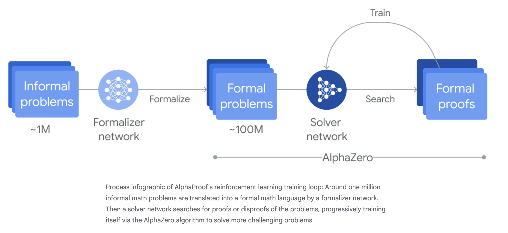
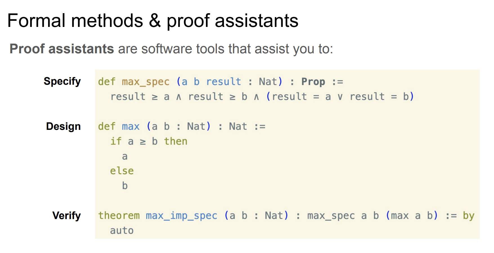

# formal verification

<br>

## tl; dr

<br>

* formal methods are a set of techniques and specialized tools used to specify, design, and verify
complex systems with mathematical rigor
    - 1. specify: describe a system's desired behavior precisely
    - 2. design: develop system components with assurance they'll work as intended
    - 3. verify: prove or provide evidence that a system meets its specification
- [Lean 4 tactic cheatsheet](https://leanprover-community.github.io/papers/lean-tactics.pdf)

<br>

<p align="center">

</p>


<br>

---

## proof assistant

<br>

* a piece of software that provides a language for defining objects, specifying properties of these objects, and proving that these specifications hold (i.e., the system checks that these proofs are correct down to their logical foundation)
* in a formalization, all definitions are precisely specified and all proofs are virtually guaranteed to be correct.

<br>

<p align="center">

</p>

<br>

---

## proving tactics

<br>

---

### rfl

<br>

* reflexivity of equality: anything is equal to itself
* `rfl` stands for reflexivity, a fundamental concept and a very common tactic used in proofs
* in Lean's type theory, equality is an inductive type, and `Eq.refl` a is the constructor for proving` a = a`

<br>

---

### rw

<br>

```lean
example (a b c : ℝ) : a * b * c = b * (a * c) := by
  rw [mul_comm a b]
  rw [mul_assoc b a c]
```

<br>


---

### apply

<br>

* takes a proof of a general statement or implication, and tries to match the conclusion with the current goal, and leaves the hypotheses, if any, as new goal
* if the given proof matches the goal exactly (modulo definitional equality), you can use the exact tactic instead of apply

<br>

---

### repeat

<br>

* applies a tactic (or a block) as many times as it can

